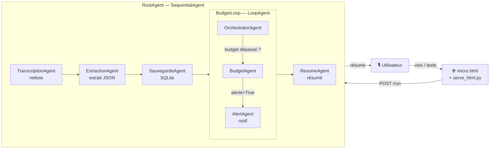
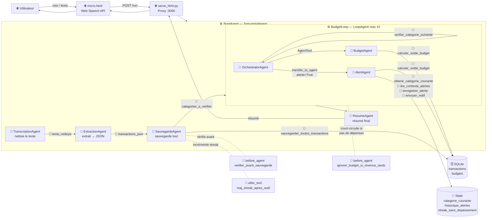
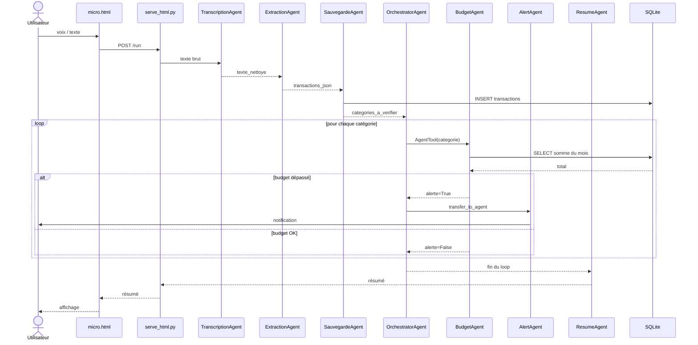

# Trackomar

Système multi-agents de suivi budgétaire vocal — Google ADK + Gemini 2.5 Flash.
Le nom *trackomar* vient du darija (arabe marocain) : "surveille ton fric" 💸

---

## Démarrage rapide

```bash
# Terminal 1 — Backend ADK
cd trackomar_adk/track_omar
adk api_server . --allow_origins http://localhost:3000
# ou en mode debug avec interface graphique :
adk web .

# Terminal 2 — Frontend
cd trackomar_adk
python serve_html.py
```

Ouvrir **http://localhost:3000** dans Chrome.

---

## Architecture

### Vue d'ensemble



---

### Légende

| Emoji | Type |
|-------|------|
| 🌐 | Frontend (navigateur / proxy) |
| ⚙️ | Workflow Agent (`SequentialAgent` / `LoopAgent`) |
| 🤖 | `LlmAgent` |
| 🔧 | Tool custom |
| 💾 | State partagé (session) |
| 🗄️ | Base de données SQLite |
| 🔔 | Callback |



---

### Séquence



---

## Agents & Workflow

### Agents LLM

| Agent | Rôle | output_key |
|-------|------|-----------|
| `TranscriptionAgent` | Nettoie le texte vocal brut | `texte_nettoye` |
| `ExtractionAgent` | Extrait toutes les transactions → JSON | `transactions_json` |
| `SauvegardeAgent` | Appelle `sauvegarder_toutes_transactions` | `resultat_sauvegarde` |
| `OrchestratorAgent` | Coordonne la vérification budget par catégorie | — |
| `BudgetAgent` | Calcule le % consommé pour une catégorie | — |
| `AlertAgent` | Génère et envoie un message taquin personnalisé | — |
| `ResumeAgent` | Génère le résumé final affiché à l'utilisateur | — |

### Workflow Agents

| Agent | Type | Rôle |
|-------|------|------|
| `RootAgent` | `SequentialAgent` | Pipeline principal : **T**ranscription → **E**xtraction → **S**auvegarde → **Loop** budget → **R**esume |
| `BudgetLoop` | `LoopAgent` (max 10) | Itère sur chaque catégorie de dépense |

### Patterns de délégation

- **AgentTool** : `OrchestratorAgent` → `BudgetAgent` (délégation avec retour)
- **transfer_to_agent** : `OrchestratorAgent` → `AlertAgent` (délégation définitive)

---

## Outils (Tools)

| Outil | Agent(s) | Accès DB | Accès State |
|-------|----------|----------|-------------|
| `sauvegarder_toutes_transactions` | SauvegardeAgent | Écriture | Lecture + Écriture |
| `verifier_categorie_suivante` | OrchestratorAgent | — | Lecture + Écriture + escalate |
| `calculer_solde_budget` | BudgetAgent, AlertAgent | Lecture | — |
| `obtenir_categorie_courante` | AlertAgent | — | Lecture |
| `lire_contexte_alertes` | AlertAgent | — | Lecture |
| `enregistrer_alerte` | AlertAgent | — | Écriture |
| `envoyer_notif` | AlertAgent | — | — |

---

## State partagé

Le state est un dictionnaire partagé entre tous les agents d'une session (`InMemorySessionService`).

| Clé | Type | Écrit par | Lu par |
|-----|------|-----------|--------|
| `texte_nettoye` | string | TranscriptionAgent (`output_key`) | ExtractionAgent, ResumeAgent |
| `transactions_json` | string JSON | ExtractionAgent (`output_key`) | SauvegardeAgent, callback |
| `resultat_sauvegarde` | string | SauvegardeAgent (`output_key`) / callback | ResumeAgent |
| `categories_a_verifier` | list | `sauvegarder_toutes_transactions` | `verifier_categorie_suivante`, callback |
| `categorie_courante` | string | `verifier_categorie_suivante` | `obtenir_categorie_courante` |
| `historique_alertes` | dict | `enregistrer_alerte` | `lire_contexte_alertes` |
| `streak_sans_depassement` | int | `maj_streak_apres_outil` / `enregistrer_alerte` | `lire_contexte_alertes` |

> **Limite** : le state est en RAM. Il est perdu à chaque nouvelle session. Pour persister `historique_alertes` et `streak_sans_depassement` entre sessions, il faudrait les stocker en SQLite.

---

## Callbacks

| Callback | Type | Sur | Déclencheur | Effet |
|----------|------|-----|-------------|-------|
| `verifier_avant_sauvegarde` | `before_agent_callback` | SauvegardeAgent | `transactions_json` absent | Court-circuite l'agent |
| `ignorer_budget_si_revenus_seuls` | `before_agent_callback` | BudgetLoop | `categories_a_verifier` vide | Court-circuite le loop |
| `maj_streak_apres_outil` | `after_tool_callback` | SauvegardeAgent | après `sauvegarder_toutes_transactions` | Incrémente le streak |

Les deux premiers callbacks ont été pensés dans une optique d'efficience : inutile de déclencher un appel LLM si les données nécessaires sont absentes ou si l'étape est sans objet.

---

## Mémoire

### Ce qui est persistant

| Donnée | Stockage | Survit au redémarrage |
|--------|----------|-----------------------|
| Transactions | SQLite | Oui |
| Budgets | SQLite | Oui |
| Historique des messages | InMemorySessionService | Non |
| State (alertes, streak) | Session RAM | Non |

### Limites actuelles

- `historique_alertes` repart à `{}` à chaque nouvelle session → AlertAgent dit toujours "première fois"
- `budget_mois_precedent` déclaré dans le state mais jamais alimenté

### Pour améliorer

Stocker `historique_alertes` et `streak_sans_depassement` dans une table SQLite dédiée, ou migrer vers `DatabaseSessionService`.

---

## Sécurité

### Risques identifiés

| Risque | Niveau | Status |
|--------|--------|--------|
| Prompt injection via texte vocal | Critique | Non protégé |
| Clé API dans fichier `.env` | Haute | À mettre en variable système en prod |
| CORS `*` dans le proxy | Haute | OK en dev, à restreindre en prod |
| Validation montant/date | Moyenne | Montant validé, date non validée |
| Rate limiting | Moyenne | Absent |
| Authentification `/run` | Basse | Absent |

### Ce qui est déjà en place

- Montant validé : `0 < montant < 100000`
- Catégories normalisées : valeur inconnue → `"autre"`
- Requêtes SQL paramétrées : pas d'injection SQL possible
- `before_agent_callback` : valide que le JSON existe avant sauvegarde

### Piste d'amélioration — détection de prompt injection

```python
# before_model_callback sur TranscriptionAgent
def detecter_injection(ctx):
    texte = ctx.state.get("texte_nettoye", "")
    patterns = ["ignore", "oublie", "system prompt", "DROP TABLE"]
    if any(p.lower() in texte.lower() for p in patterns):
        return Content(role="model", parts=[Part(text="Requête invalide.")])
    return None
```

---

## Tests & Évaluation

### Lancer les tests

Toujours remettre la DB dans un état connu avant de lancer les evals, sinon les résultats ne sont pas reproductibles :

```bash
cd track_omar/
python reset_test_db.py
adk web .   # puis onglet Eval
```

### Evalsets

Les evalsets ont été créés depuis l'interface graphique d'ADK (`adk web .`, onglet **Eval**) : j'enregistre une vraie conversation avec l'agent, ADK la sauvegarde comme référence. Les fichiers `.evalset.json` se trouvent dans `track_omar/track_omar/`, et les résultats de chaque passage sont conservés dans `track_omar/.adk/eval_history/`.

| Fichier | Cas testé |
|---------|-----------|
| `evalset_date_compliquee.evalset.json` | 2 transactions avec dates relatives + alerte budget |
| `evalset_multiple_transactions.evalset.json` | 2 dépenses catégories différentes |

### Métriques ADK

| Métrique | Seuil | Ce qu'elle mesure |
|----------|-------|-------------------|
| `tool_trajectory_avg_score` | 0.7 | Séquence d'outils appelés vs attendu |
| `response_match_score` | 0.6 | Similarité sémantique réponse vs référence |

### Pourquoi `tool_trajectory_avg_score` peut être 0

Le score dépend de l'état de la DB. Si le budget n'est pas dépassé lors du rejeu, AlertAgent n'est pas appelé → séquence différente de l'evalset → score 0. **Toujours lancer `reset_test_db.py` avant les evals.**

---

## Déploiement

Pour déployer ce projet en production, Google Cloud Run est la cible naturelle : l'écosystème est déjà Google (Gemini, ADK), c'est serverless et la facturation à l'usage évite de payer pour un service qui tourne en veille.

Le backend ADK serait containerisé avec un `Dockerfile` simple qui lance `adk api_server .`, puis déployé via `gcloud run deploy`. La clé `GOOGLE_API_KEY` passerait par Google Secret Manager plutôt que par un fichier `.env`. Le frontend `micro.html` serait servi depuis Firebase Hosting ou un second service Cloud Run, avec l'URL Cloud Run en dur à la place de `localhost:8000`. Le proxy `serve_html.py` disparaît — il n'existe que pour contourner le CORS en local.

Deux points critiques avant de passer en prod : migrer de `InMemorySessionService` vers `DatabaseSessionService` (Cloud SQL ou Firestore) pour que le state ne soit pas perdu à chaque redémarrage du container, et restreindre le CORS au domaine de production plutôt que d'autoriser `*`.

---

## Stack technique

| Composant | Technologie |
|-----------|-------------|
| Framework agents | Google ADK |
| Modèle LLM | Gemini 2.5 Flash |
| Base de données | SQLite |
| Frontend | HTML + Web Speech API (Chrome) |
| Python | 3.10+ |

---

## Structure des fichiers

```
trackomar_adk/                  ← repo git
├── .gitignore
├── README.md
├── micro.html                  ← interface web (micro + texte + envoi)
├── serve_html.py               ← proxy dev : sert HTML + redirige vers ADK
├── screens/                    ← captures d'écran (UI, evals, erreurs, modèle local...)
└── track_omar/                 ← agents_dir (lancer ADK depuis ici)
    ├── main.py                 ← runner programmatique (CLI)
    ├── reset_test_db.py        ← remet la DB dans un état connu avant eval
    ├── .adk/
    │   └── eval_history/       ← résultats des evals (générés par ADK)
    └── track_omar/             ← package Python
        ├── __init__.py
        ├── agent.py            ← tous les agents + workflow
        ├── callbacks.py        ← 3 callbacks
        ├── evalset_1_simple_revenu.evalset.json
        ├── evalset_date_compliquee.evalset.json
        ├── evalset_multiple_transactions.evalset.json
        └── tools/
            ├── __init__.py
            ├── my_tools.py     ← 7 outils custom
            └── trackomar.db    ← base SQLite
```

---

## Erreurs rencontrées

### CORS

Le problème le plus classique au démarrage. Le navigateur bloque la requête parce que le frontend (`:3000`) et le backend ADK (`:8000`) sont sur des ports différents.

```
Access to fetch at 'http://localhost:8000/run' from origin 'http://localhost:3000'
has been blocked by CORS policy
```

**Pourquoi** : `adk web` ne gère pas les preflight OPTIONS → toutes les requêtes depuis le frontend sont bloquées.

**Fix** : utiliser `adk api_server` avec `--allow_origins` et passer par le proxy `serve_html.py`.

```bash
# Ne pas faire
adk web .

# Faire
adk api_server . --allow_origins http://localhost:3000
```

---

### Erreurs de dev


**Transactions pas sauvegardées**

L'ancien design demandait au LLM d'itérer sur une liste de transactions et d'appeler un outil pour chacune. Le LLM ne suivait pas les instructions — il en sautait ou s'arrêtait trop tôt. Fix : une seule fonction Python `sauvegarder_toutes_transactions()` qui parse le JSON et sauvegarde tout sans passer par le LLM.

**`budget_resultat` stockait du texte au lieu de JSON**

`BudgetAgent` avait un `output_key="budget_resultat"` mais `output_key` stocke la réponse textuelle du LLM, pas le retour de l'outil. Donc AlertAgent recevait une phrase en français au lieu d'un JSON avec `alerte: true`. Fix : supprimer `output_key` sur BudgetAgent et faire appeler `calculer_solde_budget()` directement par AlertAgent.

**Micro qui capte seulement le premier mot**

Chrome coupe la reconnaissance vocale après chaque silence même avec `continuous = true`. L'objet `SpeechRecognition` ne peut pas être relancé — il faut en créer un nouveau. Fix : dans `onend`, si l'utilisateur veut encore parler, je crée une nouvelle instance après 100ms.

---

### Modèle local — tentative Gemma

J'ai tenté de remplacer `gemini-2.5-flash` par `ollama/gemma2` sur le `TranscriptionAgent` uniquement. Résultat : le PC a souffert — Gemma2 est trop lourd pour tourner en local en parallèle avec le reste du pipeline.

Les modèles locaux posent plusieurs problèmes sur ce projet :
- **RAM** : un modèle 7B+ consomme 8-16GB — le pipeline en a besoin plusieurs fois
- **Function calling** : tous les modèles locaux ne supportent pas les tool calls nativement
- **Latence** : chaque appel LLM prend 10-30s en local vs 1-3s avec Gemini API

Pour ce projet, l'API Google (Gemini 2.5 Flash) a été utilisée pour tous les agents — les modèles locaux étant trop lents et peu compatibles avec le function calling natif requis par ADK.

---

## Bonnes pratiques — Tests

### Pourquoi `tool_trajectory_avg_score` est 0

Le score compare la séquence d'outils appelés lors du rejeu vs ce qui était enregistré dans l'evalset.

Le problème : `calculer_solde_budget()` lit la vraie DB. Si la DB a plus ou moins de données qu'au moment de l'enregistrement, `alerte: true/false` change → AlertAgent est appelé ou pas → séquence différente → score 0.

```
Evalset enregistré  →  DB avait 2575€ resto  →  alerte=True  →  AlertAgent appelé
Eval rejoué         →  DB vide               →  alerte=False →  AlertAgent pas appelé
                                                               → tool_trajectory = 0.0
```

**Fix** : toujours lancer `reset_test_db.py` avant chaque eval.

---

### Bug nltk au lancement de l'eval

```
AttributeError: partially initialized module 'nltk' has no attribute 'data'
```

ADK eval utilise `rouge-score` pour comparer les réponses, qui dépend de `nltk`. Si `nltk` n'est pas bien initialisé, l'eval plante sans afficher aucun résultat.

```bash
pip install --upgrade nltk rouge-score
python -c "import nltk; nltk.download('punkt'); nltk.download('punkt_tab')"
```

---

### Pièges à éviter lors de la création d'un evalset

**Evalset enregistré avec une ancienne version de l'agent** — après une refacto d'outil (ex: `sauvegarder_transaction` → `sauvegarder_toutes_transactions`), les anciens evalsets ont l'ancien nom → `tool_trajectory = 0.0`. Il faut re-enregistrer les evalsets depuis l'UI ADK après chaque refacto.

**L'evalset dépend de l'état de la DB** — un evalset enregistré quand le budget était dépassé ne sera pas reproductible sur une DB vide. Il faut toujours enregistrer les evalsets juste après `reset_test_db.py`.

**`response_match_score` bas à cause de la catégorisation** — le LLM peut classer "grec" en `courses` au lieu de `resto`. Si la `reference` dit "resto" mais que l'agent répond "courses", le score baisse. Ajuster la `reference` ou améliorer l'instruction de l'ExtractionAgent.

---

## Perspectives d'amélioration

- **Meilleur modèle par agent** : utiliser `gemini-2.5-pro` pour l'ExtractionAgent (le plus critique) et garder Flash pour les agents simples comme la transcription ou le résumé — réduire les coûts sans sacrifier la précision là où ça compte.
- **Persistance du state** : migrer vers `DatabaseSessionService` pour que `historique_alertes` et `streak_sans_depassement` survivent entre sessions.
- **ParallelAgent pour le budget** : vérifier plusieurs catégories en parallèle au lieu de les itérer une par une dans un `LoopAgent`.
- **Authentification** : ajouter un token sur `/run` pour éviter que n'importe qui puisse envoyer des transactions.
- **Protection contre le prompt injection** : ajouter un `before_model_callback` sur le `TranscriptionAgent` pour détecter les tentatives de manipulation du prompt.
- **Budget dynamique** : alimenter `budget_mois_precedent` depuis la DB pour adapter les limites au profil de dépense de l'utilisateur.

---

*Ce projet a été réalisé avec les assistants IA*

