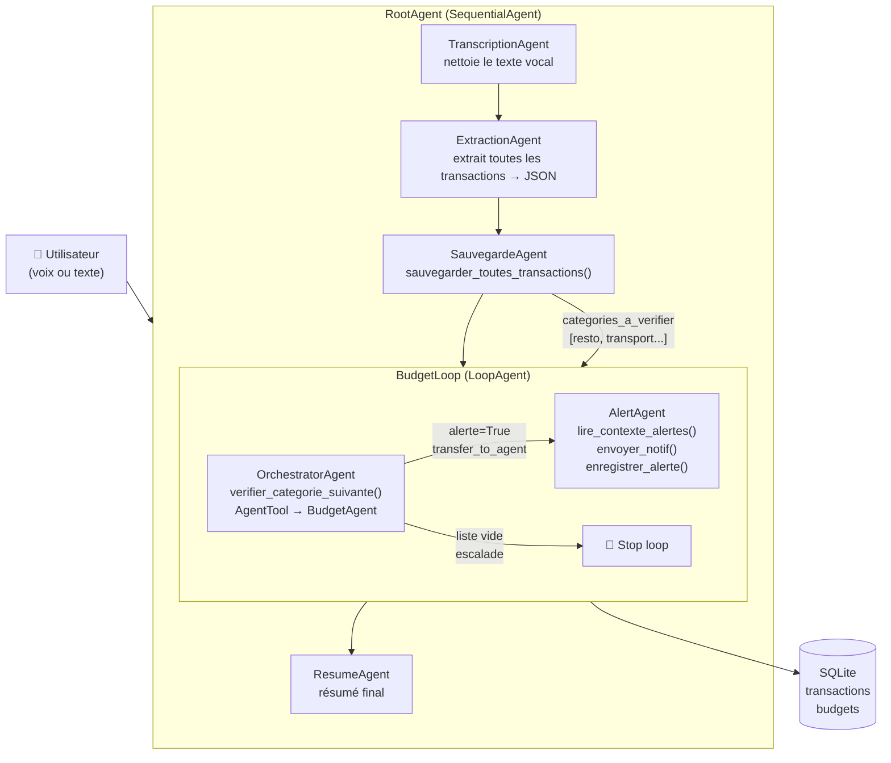

# Trackomar 🎙️💸

> Système multi-agents de suivi budgétaire vocal — Google ADK + Gemini

---

## Description

Trackomar est un système multi-agents construit avec le framework **Google ADK (Agent Development Kit)**. L'utilisateur parle de ses dépenses et revenus, le système transcrit, extrait, sauvegarde et analyse les transactions automatiquement.

Le frontend utilise la **Web Speech API** du navigateur (Chrome) pour la transcription vocale locale, sans dépendance à Gemini Live API.

---

## Architecture actuelle



---

## Contraintes TP couvertes

| # | Contrainte | Implémentation |
|---|-----------|----------------|
| 1 | 3+ LlmAgents | TranscriptionAgent, ExtractionAgent, SauvegardeAgent, BudgetAgent, OrchestratorAgent, AlertAgent, ResumeAgent **(7 agents)** |
| 2 | 3+ tools custom | `sauvegarder_toutes_transactions`, `verifier_categorie_suivante`, `obtenir_categorie_courante`, `calculer_solde_budget`, `lire_contexte_alertes`, `enregistrer_alerte`, `envoyer_notif` **(7 tools)** |
| 3 | 2 Workflow Agents différents | `SequentialAgent` (pipeline principal) + `LoopAgent` (boucle budget par catégorie) |
| 4 | State partagé | `output_key` sur TranscriptionAgent (`texte_nettoye`) et ExtractionAgent (`transactions_json`), state entre tous les agents via `ToolContext` |
| 5 | `AgentTool` + `transfer_to_agent` | OrchestratorAgent invoque BudgetAgent via `AgentTool(budget_agent)`, puis délègue à AlertAgent via `transfer_to_agent` si alerte |
| 6 | 2 callbacks différents | `before_agent_callback` sur SauvegardeAgent (vérifie que le JSON existe avant de lancer) + `after_tool_callback` sur SauvegardeAgent (met à jour le streak après sauvegarde) |
| 7 | Runner programmatique | `main.py` — à faire |
| 8 | Démo fonctionnelle | Interface web custom (`micro.html`) + `adk web` |

---

## Stack

| Composant | Technologie |
|-----------|------------|
| Framework agents | Google ADK (`google-adk`) |
| Modèle LLM | `gemini-2.5-flash` via Google AI Studio |
| Base de données | SQLite |
| Frontend | HTML + Web Speech API (Chrome) |
| Python | 3.10.11 |

---

## Structure des fichiers

```
agentic_ai/
├── readme.md
├── micro.html              ← interface web (micro + champ texte + envoi)
├── serve_html.py           ← proxy Python : sert le HTML et redirige vers ADK
└── track_omar/             ← agents_dir (lancer ADK depuis ici)
    ├── .env                ← clé API (ne pas commiter)
    └── track_omar/         ← package agent
        ├── __init__.py
        ├── agent.py        ← tous les agents + workflow
        ├── callbacks.py    ← before_agent_callback + after_tool_callback
        └── tools/
            ├── my_tools.py ← tous les outils custom
            └── trackomar.db← base SQLite (transactions + budgets)
```

---

## Installation

```bash
# Cloner le repo
git clone <repo_url>
cd agentic_ai

# Créer l'environnement virtuel
python -m venv .venv
source .venv/bin/activate  # Mac/Linux
.venv\Scripts\activate.bat  # Windows CMD

# Installer les dépendances
pip install google-adk
```

### Configuration

Créer un fichier `.env` dans `track_omar/track_omar/` :

```env
GOOGLE_GENAI_USE_VERTEXAI=FALSE
GOOGLE_API_KEY=ta_cle_ici
```

---

## Lancement

**2 terminaux en même temps.**

**Terminal 1 — ADK** (depuis `agentic_ai/track_omar/`) :
```bash
cd agentic_ai/track_omar
adk api_server . --allow_origins http://localhost:3000
```

**Terminal 2 — Interface web** (depuis `agentic_ai/`) :
```bash
cd agentic_ai
python serve_html.py
```

Ouvrir **http://localhost:3000** dans **Chrome** (pas Firefox).

**Debug via interface ADK** :
```bash
cd agentic_ai/track_omar
adk web .
```

---

## Exemples de requêtes

Via l'interface web ou via curl :

```bash
# 1. Créer une session
curl -X POST http://localhost:8000/apps/track_omar/users/u_1/sessions \
  -H "Content-Type: application/json" -d '{}'

# 2. Envoyer une transaction (utiliser l'id retourné par l'étape 1)
curl -X POST http://localhost:8000/run \
  -H "Content-Type: application/json" \
  -d '{
    "app_name": "track_omar",
    "user_id": "u_1",
    "session_id": "<id_session>",
    "new_message": {
      "role": "user",
      "parts": [{"text": "j ai depense 12 euros au kebab hier"}]
    }
  }'
```

Exemples de phrases :
```
"J'ai payé 12€ au resto et 5€ de transport"
"J'ai reçu mon salaire de 1500€"
"Hier j'ai fait des courses pour 45€"
"J'ai payé le loyer 650€"
"30€ de loisirs et 20€ de sante aujourd'hui"
```

---

## Budgets

Les budgets sont dans SQLite. Quand une catégorie dépasse **80%**, AlertAgent envoie un message taquin personnalisé.

```bash
sqlite3 track_omar/track_omar/tools/trackomar.db
```

```sql
INSERT INTO budgets (categorie, limite) VALUES ('resto', 100);
INSERT INTO budgets (categorie, limite) VALUES ('transport', 50);
INSERT INTO budgets (categorie, limite) VALUES ('courses', 200);
INSERT INTO budgets (categorie, limite) VALUES ('loisirs', 150);
INSERT INTO budgets (categorie, limite) VALUES ('loyer', 700);
```

---

## Changelog

### v0.4.0 — 2026-03-06
**Ajouts**
- `BudgetAgent` + `AlertAgent` avec messages taquins personnalisés selon l'historique
- `OrchestratorAgent` avec `AgentTool(BudgetAgent)` + `transfer_to_agent → AlertAgent`
- `LoopAgent` (`BudgetLoop`) qui itère sur chaque catégorie de dépense affectée
- 2 callbacks : `before_agent_callback` (validation JSON) + `after_tool_callback` (streak)
- `callbacks.py` séparé pour les callbacks
- 7 tools custom : `sauvegarder_toutes_transactions`, `verifier_categorie_suivante`, `obtenir_categorie_courante`, `calculer_solde_budget`, `lire_contexte_alertes`, `enregistrer_alerte`, `envoyer_notif`
- Colonne `created_at` ajoutée à la table `transactions`
- `serve_html.py` migré de `127.0.0.1` vers `localhost` (fix micro Chrome)
- Fix : création de session automatique avant `/run` (plus de 404 session not found)
- Fix : body de `/run` en snake_case (`app_name`, `user_id`, `session_id`, `new_message`)
- Fix : micro rechargé via nouvelle instance dans `onend` (fix syllabe unique)
- Fix : bouton "Envoyer" utilise `finalTranscript` du micro ou le champ texte

**Problèmes résolus**
- `{transaction_courante}` dans les instructions → remplacé par outils (`obtenir_categorie_courante`)
- `State object has no attribute 'keys'` → utiliser `.get()` uniquement
- `output_key="budget_resultat"` stockait du texte prose au lieu de JSON → supprimé
- LLM n'itérait pas correctement sur les transactions → `sauvegarder_toutes_transactions()` en Python pur

---

### v0.3.0 — 2026-03-06
**Ajouts**
- Support des revenus (`type: revenu`) en plus des dépenses
- Contexte temporel injecté dans ExtractionAgent (hier, demain, jours de la semaine)
- Frontend HTML avec Web Speech API (FR/EN)
- Appel `/run` avec création de session automatique

**Problèmes connus**
- CORS bloqué avec `adk web` → utiliser `adk api_server --allow_origins http://localhost:3000 .`
- `trackomar.db` ne doit pas être dans le dossier père sinon ADK le confond avec AGENTS_DIR

---

### v0.2.0 — 2026-03-05
**Ajouts**
- Ajout de `SauvegardeAgent` séparé — séparation des responsabilités extraction / sauvegarde
- Renommage `sauvegarder_depense` → `sauvegarder_transaction` avec champ `type`
- Gestion des dates relatives dans l'instruction de l'ExtractionAgent

**Problèmes connus**
- Modèle `gemini-2.0-flash` déprécié → migré vers `gemini-2.5-flash`
- Modèle `gemini-2.0-flash-live-001` déprécié → Gemini Live API non utilisé
- Double sauvegarde si `sauvegarder_transaction` présent dans ExtractionAgent ET SauvegardeAgent

---

### v0.1.0 — 2026-03-04
**Ajouts**
- Structure initiale du projet ADK
- `TranscriptionAgent` + `ExtractionAgent` dans un `SequentialAgent`
- Tools : `sauvegarder_depense`, `calculer_solde_budget`, `envoyer_notif`, `lister_depenses`
- Base de données SQLite avec tables `transactions` et `budgets`

**Problèmes connus**
- `adk web` lance correctement mais le bouton micro utilise Gemini Live API (erreur 404 modèle non trouvé)
- Gemini Live API incompatible avec SequentialAgent/ParallelAgent/LoopAgent → solution : Web Speech API côté navigateur
- `.env` doit être présent dans `track_omar/track_omar/` pour être chargé
- `adk web` doit être lancé depuis le dossier père (`track_omar/`), pas depuis `track_omar/track_omar/`

---

## Problèmes connus (global)

| Problème | Cause | Solution |
|----------|-------|----------|
| `OPTIONS 405 Method Not Allowed` | CORS preflight non géré par `adk web` | Utiliser `adk api_server --allow_origins http://localhost:3000 .` |
| Gemini Live API audio non fonctionnel | SequentialAgent incompatible avec streaming | Web Speech API navigateur à la place |
| Micro capte qu'un mot | Chrome coupe la reco vocale après chaque silence | Relance automatique dans `onend` avec nouvelle instance + délai 100ms |
| Session not found 404 | Session pas créée avant `/run` | Appel `POST /apps/.../sessions` avant le premier `/run` |

---

## À venir

- [x] OrchestratorAgent avec `transfer_to_agent` et `AgentTool`
- [x] LoopAgent pour vérification budget par catégorie
- [x] BudgetAgent + AlertAgent avec messages taquins personnalisés
- [x] Callbacks (validation + streak)
- [ ] ParallelAgent (ex: analyse stats en parallèle de la sauvegarde)
- [ ] Runner programmatique `main.py`
- [ ] Tests JSON pour `adk eval`
